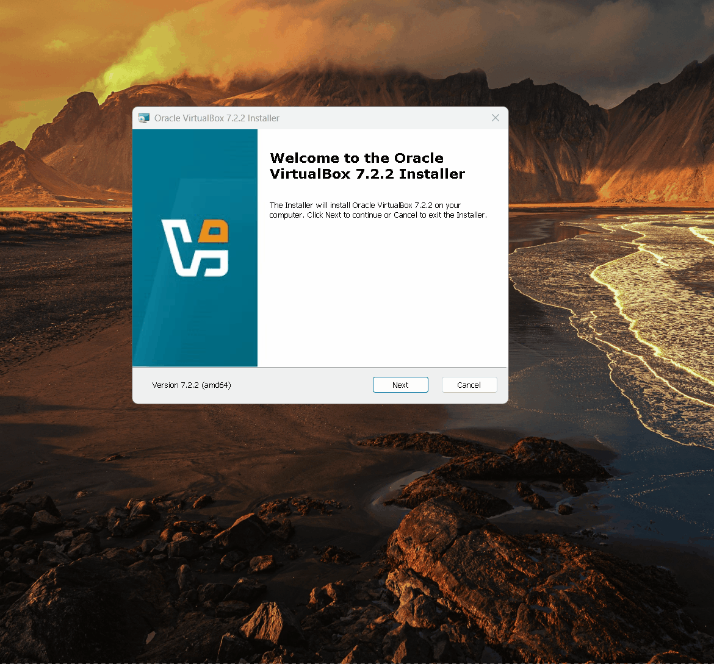
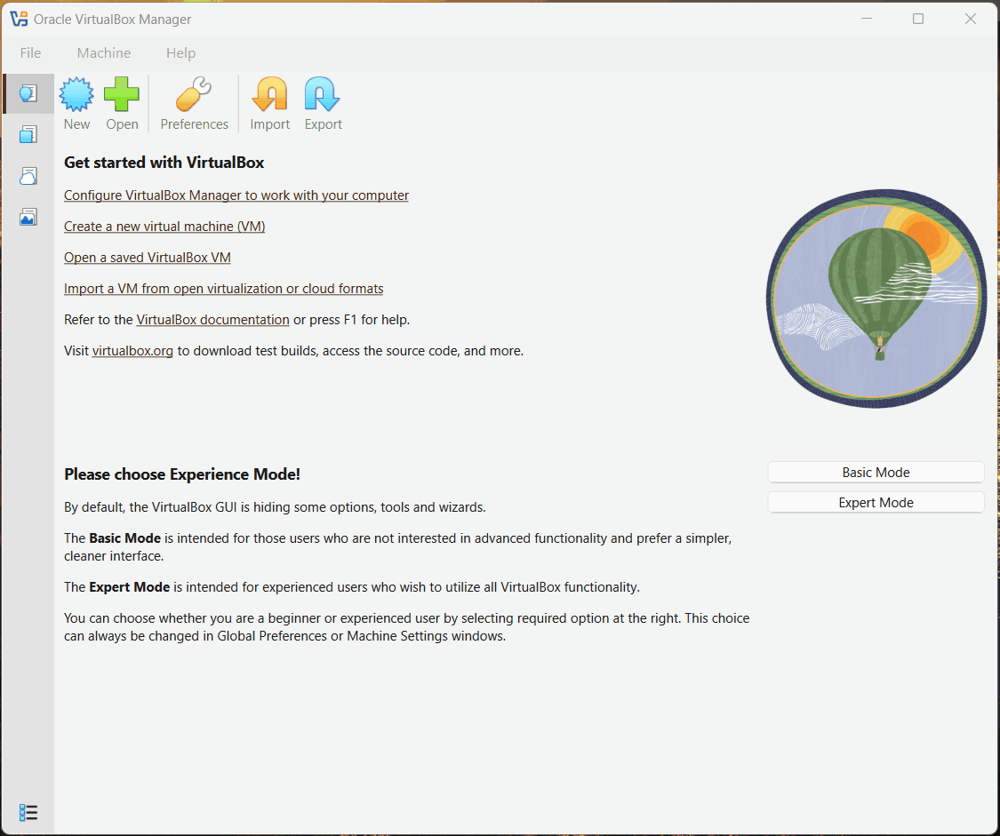
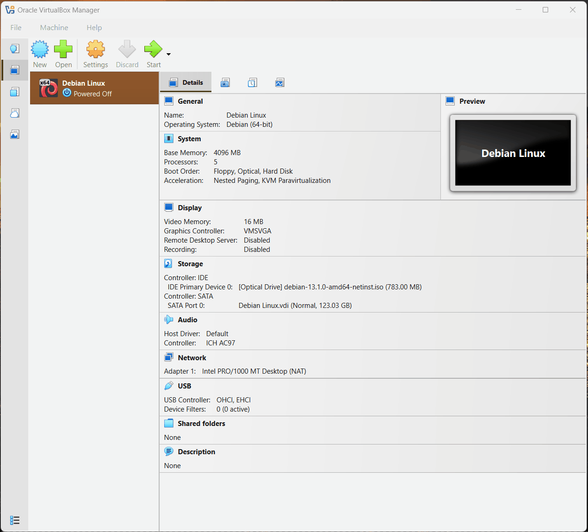
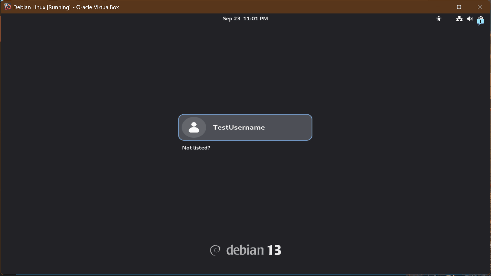

<!-- Back to top link -->
<a id="readme-top"></a>

# $${\color{hotpink}Getting \space Started \space with \space Virtualization}$$
## $${\color{hotpink}\space \space \space \space and \space Linux \space Distributions}$$

<!------------- Overview & Requirements --------------->
<a id="overview"></a>


<h3><summary>Overview</summary></h3>
<details>
<summary>Project consists of aquiring <b>Oracle VirtualBox VM</b> and <b>Debian GNU/Linux</b> from their official sources, and installing them, primarily adhering to the default installation settings / minimum resource allocation requirements.</summary>
        <ul>
        <details>
        <summary>VirtualBox's suite of virtualization technologies allows deployment of  <b>operating systems(OS), virtual machines(VM), and applications</b> within a fully equipped virtualized environment.
        </summary> 
            <ul>
            <li>
            Type 2 hypervisor's, like Oracle VirtualBox VM, run on top of an existing operating system and create/manage virtual machines.</li>
            <li>Debian GNU/Linux will be deployed inside the virtual machine created by Oracle VirtualBox VM's hypervisor.</li>
            </ul>
        </ul>
        </details>
        </ul>
    </details>

<br/>

<details>
<summary><b>Requirements</b></summary>
<ol>
<summary>Running a live system like GNOME desktop environment requires additional resource allocation. GNOME can run on lower-end hardware, but performance improves significantly with more RAM</summary>
            <ul><b>Minimum:</b>
            <li>
            RAM: 2 GB; 4GB or more is recommended for GNOME.
            </li>
            <li>
            CPU: 1 GHz single-core processor; 2 cores or more for better performance.            
            </li>
            <li>
            Storage: 25 GB of disk space for a full GNOME desktop installation; add more storage if you plan on storing large files.
            </li>
        </details>
        </ul>
    </details>
</details>
<br/>
<br/>


<!--------------Table of contents--------------->


<details>
<summary><b><b>Table of Contents</b></b></summary>
<ol>
<a href="#overview">Oveview & Requirements</a>
</ol>

<ol>
<a href="#gif1">Oracle VirtualBox Download »</a>
    <ul>
    <a href="#gif2">Installation »</a>
    </ul>
</ol>

<ol>
<a href="#gif3">Debian ISO Download »</a>
    <ol>
    <a href="#gif4">New VM »</a>
    </ol>
    <ol><a href="#gif5">EUFI Settings »</a></ul>
    </ol>
</ol>

<ol>
<a href="#gif6">Debian Boot »</a>
    <ul>
    <a href="#gif7">Gnome | LibreOffice Writer »</a>
</ol>
</details>

<br/>


<!---------------- ***ORACLE VB*** ------------------>

<a id="gif1"></a>
## 🖥️ Oracle VirtualBox VM Aquisition & Installation


<p align="center">
Launch your browser and head over to the <a href="https://www.virtualbox.org/">Oracle VirtualBox VM official site</a>: 
<br/>
<br/>

<br/>
<br/><a id="gif2"></a>
<br/>
Run the <b>.exe</b> file we just <a href="https://www.virtualbox.org/wiki/Downloads">downloaded</a> to install Oracle VirtualBox VM:<br/><br/>

<br/>
</p>

<h2 align="center">🎉🎉🎉 <b>CONGRATULATIONS!</b> 🎉🎉🎉</h2>
<p align="center">You just downloaded and installed Oracle VirtualBox VM! 🥳</p>
<p align="right">(<a href="#readme-top"><strong>back to top »</strong></a>)</p>
<br/>
<br/>
<br/>

<!----------------         ***DEBIAN GNU/LINUX***        ------------------>


<a id="gif3"></a>
## 🐧 Debian GNU/Linux ISO Aquisition & Installation

<p align="center">
Launch your browser and head over to the <a href="https://www.debian.org/">official Debian website</a>: 
<br/>
<br/>

<br/>
<br/><a id="gif4"></a>
<br/>
Create a new VM in the <b>Oracle VirtualBox Manager</b>, and Attach the <b>.iso</b> file we just <a href="https://www.debian.org/download">downloaded</a>
<br/>
<br/>

<br/>
<br/>
<br/><a id="gif5"></a>
<p align ="center">
Enable <b>EUFI</b> and start the virtual machine.
<br/>
<br/>

<br/>
<br/>
<br/><a id="gif6"></a>
<p align ="center">
Follow the <b>installer</b> and configure the system.
<br/>
<br/>

<br/>
<br/>
<br/><a id="gif7"></a>
<p align ="center">
Log in with the credentials we created to enter the <b>GNOME</b> desktop environment.
<br/>
<br/>

</p>

<h2 align="center">🎉🎉🎉 <b>CONGRATULATIONS!</b> 🎉🎉🎉</h2>
<p align="center">You just installed GNOME, a Linux distro, onto a virtual machine!🥳</p>


<p align="right">(<a href="#readme-top"><strong>back to top »</strong></a>)</p>


<!--
 ```diff
- text in red
+ text in green
! text in orange
# text in gray
@@ text in purple (and bold)@@
```
